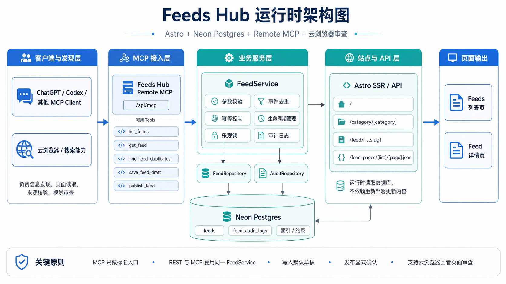
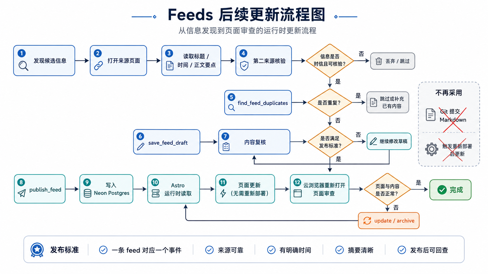

# Feeds Hub

AI-powered information hub built with Astro.

Feeds Hub 把公开信息搜索、主题筛选、事实核验、去重、结构化 Markdown、Neon 数据同步和 Production 发布串成一套可复制流程。仓库保存应用代码、项目规则、处理后的 feed 内容和运行证据；跨仓库 AI Engineering 工作流以 [`idaibin/ai-handbook/workflows/ai-engineering-system/`](https://github.com/idaibin/ai-handbook/tree/main/workflows/ai-engineering-system) 为唯一权威，可复用技能由 [`idaibin/skills`](https://github.com/idaibin/skills) 维护。

产品系统边界为 `Sources → Feeds → Research → Insights`。当前已验证 runtime
只覆盖 Feed；Research/Insights 的生成、存储、Review 和发布仍为 `Not verified`。
Feeds Hub 不承担 Createway 的最终内容出版，也不承担 Story Studio 的课程、漫剧
或视频生产。

## 用途

- 个人 AI 新闻入口
- 股市每日闭市、科技、开源或产品简报
- 微博 / X / V2EX 公共热点简报
- 世界杯、LOL 等赛事追踪
- 团队内部信息看板
- 自定义主题信息流站点

## 文档入口

| 文件 | 负责 |
|---|---|
| `DESIGN.md` | Google DESIGN.md 格式的共享视觉语义、tokens 和组件状态 |
| `docs/rules/repo-scope.md` | 仓库边界和允许修改路径 |
| `docs/automation/feeds-hub-update.md` | AI 更新任务入口 |
| `docs/automation/grok-realtime-discovery.md` | Grok `ai` 每小时无人审稿发布任务与后续最小权限升级门禁 |
| `docs/automation/gemini-spark-deep-research.md` | Gemini Spark 周频单主题 Research Dossier 任务 |
| `docs/topics/README.md` | 主题列表和主题文档格式 |
| `docs/topics/<category>.md` | 单主题范围、来源、跳过条件 |
| `docs/rules/content-format.md` | frontmatter、标题、摘要、正文格式 |
| `docs/rules/ui-spec.md` | 页面、card 和详情页展示规则 |
| `docs/architecture/feed-runtime.md` | 运行时架构、任务边界和依赖顺序 |
| `docs/architecture/feed-runtime-contracts.md` | Feed 领域模型、API 与 MCP 契约 |
| `docs/architecture/feed-runtime-migration.md` | 数据迁移、切换与回滚方案 |
| `docs/architecture/knowledge-candidate-handoff.md` | Feed 到 AI Handbook 的候选交接边界（目标规范，尚未实现） |
| `docs/operations/feed-runtime-production-cutover.md` | Production-only 上线、验证与回滚 runbook |
| `docs/operations/feed-mcp-oauth.md` | Remote MCP OAuth、Vercel 与 ChatGPT Dev Mode 配置 |
| `docs/operations/feed-mcp-gemini-grok.md` | Gemini Spark / Grok MCP 接入与查询写入验收 |
| `docs/operations/feed-mcp-auth0-chatgpt-setup.md` | MCP 设计、开发、Auth0、Vercel、Neon、验证与踩坑完整复盘 |
| `docs/progress/feed-runtime.md` | 分阶段实施进度和真实验证结果 |

## 默认主题

| 分类 | 说明 |
|---|---|
| `worldcup` | 世界杯赛程、进程、赛果和单场事件 |
| `lol` | LOL 赛事赛程、进程、赛果、阵容和规则 |
| `stock` | A 股、港股、美股每日闭市简报 |
| `github` | GitHub 昨日热门仓库和技术内容 |
| `hot` | 微博、X 和 V2EX 最新公共热点，按小时限量汇总 |
| `ai` | AI 模型、产品、论文、工具、政策和公司动态 |
| `compute` | AI 基础设施、芯片、HBM、数据中心、电力和云资本开支 |
| `rust` | Rust、开源、工具链、crate、RFC 和安全公告 |
| `dev` | TypeScript、Node、前端框架、运行时、云平台和开发工具 |
| `security` | CVE、安全公告、供应链风险、开源依赖和云安全事件 |
| `product` | 创业、产品设计、增长、定价、平台和商业化 |
| `global` | 全球范围高信号公共事件 |

## 更新流程

完整执行规则见 `docs/automation/feeds-hub-update.md`。核心顺序：

```text
topics -> sources -> dedupe -> kind -> draft/publish transaction
       -> Production database verification -> public live readback
```

必要原则：

- 1 feed = 1 event。
- 信息准确、可核验、去重表达优先。
- `cover` / `coverStatus` 只作 schema 兼容；`coverStatus` 固定为 `pending`。
- 普通 feed 不自动进入 AI Handbook 或 Blog；未来 candidate 交接必须是显式、幂等、
  可审计的独立步骤。

## 运行时架构

当前代码具备 Astro Content Collection / Neon Postgres 双读取源、受保护的 Feed 写入 API，以及 Astro 内的 Remote MCP Server。Production 已切换为 Neon Postgres 读取并启用受保护的写入与 MCP；截至 `2026-08-13` 的最近一次核验为 236 条 Feed（235 published、1 draft）。精确 commit、deployment、数据库计数与恢复点见 [`docs/progress/feed-runtime.md`](docs/progress/feed-runtime.md)；不得仅根据代码默认值推断线上状态。Grok 负责 AI 的无人审稿兼容发布；Gemini Spark 的 Dossier 仍是 Research 工作副本，不属于已验证 runtime。



初始化切换历史顺序为 `content → database → read-only MCP → writes`，该阶段已经完成。现在的例行内容发布直接遵循 `sources → Production dedupe → draft → publish → database/public readback`，不新增 Markdown、不提交 `main`、不触发部署。`src/content/**` 与 `ContentFeedSource` 继续作为历史导入和恢复来源，不删除。数据库导入是独立的受控步骤；Vercel 构建成功本身不代表 Feed 已写入 Neon。



## 内容结构

```text
src/content/<category>/<yyyy-mm-dd>-<slug>.md
```

frontmatter 中的 `cover` 是历史兼容占位，不参与展示，也不要求对应文件存在。建议使用稳定站点路径：

```text
/images/<category>/<yyyy-mm-dd>-<slug>.webp
```

`reviewed: true` 的内容才会展示。

## 本地运行

```bash
npm install
npm run dev
```

## 校验

```bash
npm ci
npm run test
npm run test:mcp
npm run db:generate
npm run db:check
npm run content:import:dry
npm run check
npm run build
```

`npm run test:integration` 只能连接明确隔离的非 Production 测试数据库；Production migration、例行内容同步、切换和回滚必须逐项执行 [`Production runbook`](docs/operations/feed-runtime-production-cutover.md)。

## 部署

推荐 Vercel：

```text
Framework Preset: Astro
Build Command: npm run build
Output Directory: 由 @astrojs/vercel 生成，不手工覆盖
Install Command: npm ci
```

`vercel.json` 使用 Vercel 官方 [`git.deploymentEnabled`](https://vercel.com/docs/project-configuration/git-configuration#gitdeploymentenabled) minimatch 分支匹配：`main` 显式为 `true`，覆盖含 `/` 分支名的 `**` 为 `false`。这会阻止非 `main` push 触发 Git 自动 deployment；它不是 Ignored Build Step。操作者也不得用 CLI 或 Dashboard 为其他分支手工创建 Preview。
